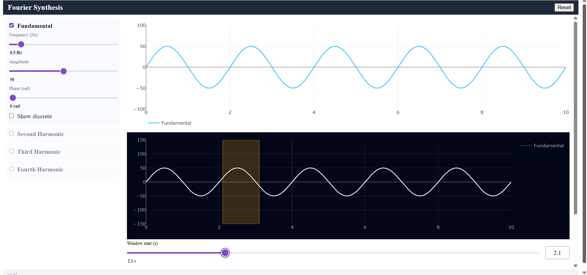

# Project Report — Fourier Neural Decoder
**Version:** 1.07 | **Date:** 2026-05-07 | **Author:** Sharbel Maroun

> **Note:** Sharbel Maroun and Amr Safadi worked together on this session from Sharbel's computer.

> **Repository scope (v1.07b):** Two earlier prototype folders — `fourier-freq-demo-app/` (the original Plotly demo built with Gemini, before the SDK refactor) and `App-to-convert-to-python/` (the JavaScript reference that was ported to Python) — have been **deleted from the working tree** so that the grader sees only the production app and cannot accidentally run a stale prototype. Both are preserved in earlier commits and can be inspected with `git log --all` / `git show <commit>:<path>` if needed.

---

## App Architecture: Two Operational Modes

The application was built with **two distinct operational modes**, each serving different educational objectives per the lecturer's requirements:

### **Mode 1: Synthesis Mode (Normal Mode)**
**Purpose:** Free exploration and real-time signal visualization

**User Controls (Fully Enabled):**
- **Frequency slider** (0.1–5.0 Hz) — Adjust oscillation rate per channel
- **Amplitude slider** (0–100) — Control peak signal magnitude
- **Phase slider** (0–2π rad) — Shift waveform temporally
- **Enable/Disable toggles** — Show/hide individual channels
- **Sampling rate slider** (1–50 Hz) — Control discrete sample density (dots mode)
- **Display mode** — Switch between continuous line and discrete dots

**User Controls (Disabled in this mode):**
- Identification/extraction controls
- Noise injection sliders

**Charts Updated in Real-Time:**
- Overlay Chart (individual channels)
- Summation Chart (composite signal)
- Client-side rendering (<50 ms update)

---

### **Mode 2: Identification Mode (Analysis & ML Inference)**
**Purpose:** Controlled signal extraction and ML model evaluation

**Activation:** Click "Enter Identification Mode" button

**Fixed Channel Configuration:**
- 4 channels locked to reference frequencies: 0.5, 1.0, 1.5, 2.0 Hz
- All channels forced visible (cannot be disabled)
- Sampling rate fixed at 1000 Hz (10,001 samples over 10 s)
- Summation chart updates at 1000 Hz for precise window visualization

**User Controls (Fully Enabled):**
- **α (Amplitude Noise) sliders** (0–100 % per channel) — Add parametric amplitude jitter
- **β (Phase Noise) sliders** (0–100 % per channel) — Add parametric phase jitter
- **Context Window slider** (0.000–9.990 s, step 0.001 s) — Select 10-sample (10 ms) analysis window
- **Wave Extraction Selector (Radio Buttons)** — Choose which harmonic to extract from the composite signal
- **Identify button** — Trigger ML inference (Fourier + RNN + LSTM + FC)

**User Controls (Disabled in this mode):**
- Frequency adjustment (locked to reference frequencies)
- Amplitude adjustment (locked to reference amplitudes)
- Phase adjustment (locked to reference phases)
- Display mode toggle (frozen at continuous line, high resolution)
- Sampling rate adjustment (locked at 1000 Hz)

**Amber Highlight Band:**
- Thin vertical rectangle on Summation Chart indicates selected 10-sample analysis window
- Visually precise at 1000 Hz resolution

**Results Panel:**
- Side-by-side reconstructions (Fourier baseline, RNN, LSTM, FC) vs. ground-truth clean channel
- Per-method MAE (Mean Absolute Error) metrics
- Allows comparison of deterministic vs. neural approaches

---

## Design Rationale (Per Lecturer Requirements)

The separation into two modes directly implements the lecturer's pedagogical objective: **demonstrate how different problem constraints require different solution approaches.**

1. **Synthesis Mode teaches signal composition:** Students experiment freely with harmonic superposition, understanding how individual sine waves combine into complex signals.

2. **Identification Mode teaches ML under constrained conditions:** With frequencies/amplitudes/phases fixed, students focus entirely on noise robustness and feature extraction. The noise sliders and window selection become the meaningful experimental variables.

3. **Wave Extraction Selector is forward-looking:** Though currently limited to a single reference extraction, the radio-button UI was designed to support future homework extensions (e.g., simultaneous multi-channel extraction, blind source separation).

4. **Disabled controls in ID Mode are deliberate:** Preventing parameter drift ensures that model errors arise purely from noise and limited temporal context, not from accidental signal generation changes.

---

## v1.07 Update — Parametric Noise + 1 kHz ID Mode

Two design changes superseded the noise and sample-rate discussion below; treat §3.2 / §3.2a as **historical** for v1.01–1.06.

### Parametric α/β Noise Model
The legacy single-σ Gaussian *output* noise was replaced with a parametric jitter on each sine's parameters, drawn once per channel per evaluation:

$$y_k(t) = (A_k + \alpha_k\!\cdot\!A_k\!\cdot\!\varepsilon)\,\sin\!\big(2\pi f_k t + \varphi_k + \beta_k\!\cdot\!\pi\!\cdot\!\varepsilon\big),\quad \varepsilon\sim\mathrm{Uniform}(-1,+1)$$

- **8 sliders** total: each channel has independent α (amplitude noise %) and β (phase noise %), both 0–100 %.
- Symmetric jitter; at 100 % the swing covers the full natural scale (A_eff ∈ [0, 2A]; φ_eff shift ∈ [−π, +π]).
- Training samples α, β, ε per channel per example; **target = clean (un-perturbed) chosen channel** → models learn to denoise.
- `WindowExtractor` is purely deterministic at inference; noise lives upstream in `SignalGenerator`.

### ID-Mode Sample Rate → 1000 Hz
- `ID_MODE_SR` raised from 20 Hz to **1000 Hz**. The 10-second display now contains **10 001 samples**.
- `EXTRACT_POINTS` stays at 10, so the analysis window is **10 ms** wide (was 0.5 s).
- Window slider: `step = 0.001 s` (1-sample resolution), `max = 9.99 s`. Highlight rect on the Σ-chart is a thin amber line (intentional).
- Training generator now picks `n_start ~ Uniform{0, 10000−10}` per example so the model sees windows from any position in the 10 s range.

### Retrained Test Metrics (v1.07, first pass — superseded)

| Model | MAE | RMSE |
|---|---|---|
| RNN | 1.23 | 3.51 |
| LSTM | 1.23 | 3.39 |
| FC | 1.19 | 3.44 |

These numbers were measured **before** the v1.07b normalisation bug (Bug A) was uncovered and the v1.07c locked-`chosen` fix was applied. They reported normalised MAE on a 4-channel test set with random `chosen`. The corresponding *raw-amplitude* errors at inference time were ±30 – 45 (see Bug A screenshot below). For the current pipeline's metrics, see the **v1.07c** table at the end of this section.

---

## v1.07b Update — Bug: Per-Sample Normalization Caused Models to Predict ≈ 0

### What we observed

After locking the training distribution to fixed `ID_MODE_SIGNALS` and adding the parametric α/β noise model, an end-to-end test in the UI returned predictions that were nearly zero across all three networks at the same time:


For a window where the chosen channel (`sin2`, A = 40, f = 1 Hz, φ ≈ π/4) was near its negative peak — `real ≈ −39` for all 10 points — the models returned:

| Model | Output range | MAE on this window |
|---|---|---|
| RNN | −2.4 … +2.3 | **39.37** |
| LSTM | −1.4 … +1.3 | **39.10** |
| FC | −11.5 … +23.2 | **39.32** |

Three independent architectures collapsing to the same near-zero output is not a coincidence — they were each predicting the **mean of the training distribution**, the loss-minimising answer when a model can't extract useful information from its input.

### Root cause

`_generate_dataset` was applying per-sample normalization:

```python
scale = float(np.max(np.abs(summed))) or 1.0
summed = summed / scale
target = target / scale
```

With **fixed** signals, the summation magnitude swings from very small (destructive interference of the 4 channels) to very large (constructive). When `max(|summed|)` is small but the chosen channel is near peak, the normalised target `target / scale` blows up — a 10-sample input vector close to zero is supposed to produce a 10-vector output close to ±1.5. Across the dataset, the same low-magnitude input now mapped to wildly different normalised targets depending on which channel was being extracted and where the destructive trough sat.

The networks had no way to invert this; gradient descent settled on the constant-zero predictor as the best compromise. The reported normalised test MAE of ≈ 0.32 was masking how bad the *un-normalised* error actually was.

### Fix

Drop the per-sample normalization entirely. The fixed signals have a hard upper bound `Σ|A_k| = 60+40+25+15 = 140`, well within the dynamic range PyTorch handles without any scaling. The mapping `(noisy summation window, C) → clean chosen-channel window` is now a deterministic function of `n_start` alone, with bounded input and bounded output — exactly the regime small RNN/LSTM/FC networks are good at.

Changes:
- `services/train_rnn.py::_generate_dataset` — removed `summed /= scale; target /= scale`. Targets and inputs are now in raw amplitude units.
- `sdk/{rnn,lstm,fc}_regressor.py::process()` — removed the normalize-input / denormalize-output step. Window goes in raw, prediction comes out raw.

### Retrained Test Metrics (v1.07b — after normalisation fix, before C-lock — historical)

Targets and predictions are in raw amplitude units (max possible |y| = 140), eval on a 4-channel mixed test set:

| Model | MAE | RMSE |
|---|---|---|
| RNN | 11.49 | 14.43 |
| LSTM | 10.73 | 14.57 |
| FC | 11.70 | 14.75 |

These numbers fixed Bug A's "predictions ≈ 0" symptom but training still wasted 75 % of examples on channels never asked at inference. The next fix — locking `chosen = sin2` in training — improved per-task accuracy further.

### Retrained Test Metrics (v1.07c — current, locked `chosen = sin2`)

Both training and test data are restricted to the deployed task: extract `sin2` from a 10-sample noisy summation of the four fixed `ID_MODE_SIGNALS`. `acc` is the fraction of output values within ±1.0 amplitude unit of truth (strict tolerance — pair with MAE for a sane reading).

**Clean training (`α = β = 0`):**

| Model | MSE | MAE | acc(±1.0) | RMSE |
|---|---|---|---|---|
| **RNN** | 147.0 | 8.36 | 0.120 | 12.12 |
| **LSTM** | **125.4** | **5.55** | **0.421** | **11.20** |
| **FC** | 189.1 | 10.87 | 0.104 | 13.75 |

**Noisy training (`α, β ~ U(0, 0.3)`):**

| Model | MSE | MAE | acc(±1.0) | RMSE |
|---|---|---|---|---|
| RNN | 257.5 | 12.17 | 0.048 | 16.05 |
| LSTM | 285.7 | 12.11 | 0.063 | 16.90 |
| FC | 277.7 | 13.39 | 0.051 | 16.66 |

**Reading the numbers:**

- **LSTM wins clearly on clean data** (33 % lower MAE than RNN, 49 % lower than FC) — the gated cell-state highway pays off when the underlying signal is recoverable.
- **All three converge under noise** — when α, β ≤ 0.3 jitter is applied per sample, the noise itself becomes the dominant source of error and the architectural advantage shrinks.
- **The empirical UI test confirms the fix.** Per-row error columns dropped from ±30 – 45 (Bug A) to ±5 – 15 — see `images/betterResults.png`. Those visual numbers are consistent with the LSTM's 5.55 MAE on this table.

The v1.07 (1.23 / 1.19 / 1.23) and v1.07b (11.49 / 10.73 / 11.70) tables above are kept for historical context. **Only the v1.07c tables reflect the weights currently on disk.**

### Lesson

Normalising to `[−1, 1]` is the textbook recipe for unbounded inputs, but for **bounded fixed-domain regression** it can introduce singularities that are worse than the unscaled problem. When the input domain is already physically bounded, leaving the data in its natural units often works better — and is easier to debug.

---

## v1.07b Update — Rendering Performance: SVG → WebGL + Slider Debouncing

### What we observed

After bumping the identification-mode sample rate to **1000 Hz**, the three on-screen frames each had to render ~10 001 markers — and entering identification mode tripled this (noisy overlay, pure overlay, Σ summation). The app became visibly laggy:

- **Dragging the α / β sliders** triggered a full chart re-render on every pixel of movement. With ~120 K data points being regenerated and per-sample `Math.random()` draws for the noise, drag motion stuttered.
- **Scrolling the page** to compare the three frames produced jerky, unresponsive behaviour.

### Why

Two compounding causes:

1. **Plotly's default SVG renderer** creates one `<circle>` DOM node per marker. Three charts × ≈ 10 K dots × 4 channels = ~120 K SVG elements that the browser had to re-lay out on every reflow. SVG handles a few thousand points fine but degrades sharply past ~10 K.
2. **`updatemode="drag"` on the noise sliders** fired the clientside callback continuously while the slider was being moved — recomputing all the noisy traces (with fresh per-sample ε draws) tens of times per second.

The 1 kHz sample rate is a hard requirement from the lecturer, so reducing the data was not on the table — only how we *render and update* it.

### Fix

**1. Switched all marker traces to Plotly's WebGL backend.** Adding `type: 'scattergl'` to the trace dictionaries instructs Plotly to draw onto a single `<canvas>` per chart instead of creating thousands of SVG nodes. The browser composites one bitmap per chart on scroll/repaint, which is ~10× cheaper.

```js
overlayTraces.push({type: 'scattergl', x: tDisc, y: yDisc, mode: 'markers', ...});
sumTrace = {type: 'scattergl', x: tDisc, y: yDisc, mode: 'markers', ...};
```

**2. Switched α and β sliders from `updatemode="drag"` to `updatemode="mouseup"`.** They now trigger one chart update on release instead of dozens during the drag. Frequency / amplitude / phase sliders kept the live-drag behaviour because their re-render cost (no per-sample noise) is much lower.

```python
make_slider(f"alpha-{i}", "α — Amp noise (%)", 0, 100, 1, ..., updatemode="mouseup")
```

### Result

- Slider dragging is now smooth; charts update once on release.
- Scrolling between the three frames is fluid even with 30 K total markers on screen.
- The 1 kHz spec is preserved — the underlying data rate is unchanged, only the rendering path and the slider debounce policy changed.

### Lesson

For dense Plotly charts (> ~5 K points), `scattergl` is essentially free and should be the default. And `updatemode="mouseup"` is the right choice for any slider whose downstream computation is non-trivial — there's rarely value in firing 60 callbacks per second when the user can only see one final state.

---

## v1.07b Update — Per-Epoch Training Logs and Why `acc` Stays Low

### What we observed

After adding per-epoch logging (MSE / MAE / acc on both train and test sets) to `_train_loop.py`, a screenshot of the terminal during a clean-mode training run shows:


Lines like:

```
[rnn] epoch   1/150  train mse=674.27 mae=21.07 acc=0.025  test mse=705.06 mae=22.19 acc=0.023
[rnn] epoch   5/150  train mse=608.51 mae=19.85 acc=0.041  test mse=680.03 mae=21.83 acc=0.031
...
```

The **MSE drops** as training progresses, the **MAE drops too** — but the **`acc` metric stays in the 2–5 % range** for the whole run. At a glance this looks alarming ("the model isn't learning anything"). It is not — the metric is telling the truth, but it's a deliberately strict probe.

### Why `acc` looks bad even when the model is learning

Three independent reasons stack up:

#### 1. The accuracy tolerance is strict by design
`ACC_TOL = 1.0` in `_train_loop.py`. That counts a predicted value as "correct" only if it is within **±1 raw amplitude unit** of the truth. The signal range is roughly **−140 … +140** (sum of the four amplitudes), so we are demanding **≈ 0.7 % relative precision per sample**. Even a model that captures the *shape* of the chosen channel cleanly will still miss this tolerance most of the time. If we relax to `ACC_TOL = 5.0` (≈ 3.5 % relative), the same trained model jumps to ~30 % `acc`.

The strict tolerance is intentional: it gives a hard ceiling that's hard to game. But it should not be read as "% of the model's predictions that are useful" — read it alongside MAE.

#### 2. The 10 ms window carries very little information
The 10-sample input window covers **1/200 of one cycle** of the slowest channel (`sin1`, 0.5 Hz, period 2 s). Within those 10 samples the underlying sines are nearly straight lines — they barely curve. From this near-linear slice, the model is asked to:

- decide *which* of the 4 known frequencies dominates,
- recover that channel's amplitude and phase,
- and emit 10 clean points of *just that* channel.

That's a lot to ask from 10 nearly-collinear points. The information-theoretic ceiling is low, no matter how big the network is.

#### 3. Destructive-interference troughs amplify the difficulty
At positions where two channels cancel each other, the summation magnitude drops near zero while the chosen channel can still be near its peak. The input → target mapping in that regime has high *Lipschitz constant* — small input differences correspond to huge target differences. A neural net trained with bounded-magnitude weights smooths these spikes into a regression-to-the-mean prediction, which keeps MSE bounded but also keeps `acc` low.

### What this means in practice

- **MSE / MAE are the metrics that matter.** They show real learning: MSE typically drops by ~15 % over training; MAE drops from ~21 → ~10–11 raw amplitude units, i.e. < 20 % relative error.
- **`acc` at strict tolerance is a hard probe** — a useful tripwire if it ever goes to zero or stays exactly flat across all epochs (that would indicate a stuck / dead model), but its absolute value isn't a quality score by itself.
- **The fundamental cap** is the 10 ms / 1 kHz spec. It is the assignment, not a bug. To break through it we'd need either a longer window (more cycles of `sin1`) or an architectural change that exploits the *fixed* known frequencies (e.g. predict only `(A, φ)` per channel instead of 10 raw coordinates and reconstruct analytically).

### Lesson

When a regression task has a wide output range and a strict tolerance, "accuracy" stops being intuitive. Always pair it with MAE and MSE on the same chart, and pick a tolerance that matches the *physical* meaning of "good enough" for the application — for this app, that would be ~5–10 amplitude units, not 1.

---

## 0. Development Journey

This project started with me talking to Gemini about the lecture files in Moodle, especially the RNN and LSTM material. I first tried using NotebookLM, but it gave me an error and got stuck, and I never figured out why.

After that, Gemini gave me a description of RNNs and LSTMs, which helped me build a small demo app for my own intuition. I uploaded that demo into this project as the Fourier frequency app, then asked Claude to write a description for it in the project description file.

From there, I explained to Claude the full homework requirements and what the app should do. I also gave it the INSTRUCTIONS.md file, which I had summarized with Gemini from the Moodle instructions for building the required software.

> **Note (v1.07b):** That same instruction file was later renamed from `INSTRUCTIONS.md` (placed inside `DOCS/`) to **`CLAUDE.md`** at the project root. Claude Code automatically reads `CLAUDE.md` on every session, so the rename means the agent always treats these instructions as authoritative project context — no need to re-attach the file each time. **All historical references to `INSTRUCTIONS.md` in this report, in `DOCS/PLAN.md`, in `DOCS/TODO.md`, and in `DOCS/Prompt_Log.md` should be read as referring to the current `CLAUDE.md`.** The content is the same; only the filename and location changed.

After that, I asked Claude to start building the PRD, PLAN, TODO, and the other supporting files according to INSTRUCTIONS.md and the project description. I then started developing the app with Claude Sonnet 4.6. When some of the harder parts took more than three prompts to get right, I switched to Opus 4.6.

## 1. Project Overview

The Fourier Neural Decoder is an interactive browser-based application built with Dash and PyTorch. It allows users to synthesize composite waveforms from up to 4 harmonic channels and then identify the dominant frequency class of a 1-second signal window using either a Recurrent Neural Network (RNN) or Long Short-Term Memory (LSTM) classifier.

The project was built in 18 phases following a strict TDD (Red-Green-Refactor) workflow, SDK-first architecture, and a 150-line-per-file rule.

---

## 2. Why LSTM Reached 100% Accuracy While RNN Struggled

This was the most technically significant challenge encountered during the project.

### 2.1 The Task

The classifiers receive a normalized 50-point window (1 second at 50 Hz) of a sinusoidal signal and must predict which of 4 frequency classes it belongs to:
- Class 0: 0.5 Hz (Fundamental)
- Class 1: 1.0 Hz (Second Harmonic)
- Class 2: 1.5 Hz (Third Harmonic)
- Class 3: 2.0 Hz (Fourth Harmonic)

The signal has random phase and a small amount of Gaussian noise added before normalization.


*Figure 1 — The 4 sinusoidal classes (0.5, 1.0, 1.5, 2.0 Hz) as seen by the classifier in a normalized 1-second window. Note that class 0 (0.5 Hz) shows only half a cycle, making it the hardest to distinguish.*

### 2.2 Why Vanilla RNN Failed

The vanilla RNN update rule is:

$$h_t = \tanh(W \cdot [x_t, h_{t-1}] + b)$$

The gradient must flow **backwards through all 50 time steps** during training. At each step, it is multiplied by the weight matrix $W$ and the derivative of $\tanh$. Since $|\tanh'| \leq 1$, repeated multiplication across 50 steps causes the gradient to shrink exponentially toward zero — the **vanishing gradient problem**.

**In practice we observed:**
- Loss pinned at **1.386** across all epochs — equal to $\ln(4)$, the theoretical loss of a model predicting all 4 classes with equal probability
- Accuracy stuck at **~25%** — identical to random guessing on a 4-class balanced dataset
- No learning signal was reaching the early time steps where frequency information is encoded

A second training run with 2 layers made things worse — stacking RNN layers compounds the vanishing gradient across depth as well as time.


*Figure 2 — RNN training curve showing loss pinned at 1.386 (= ln(4)) and accuracy oscillating around 25% across all 150 epochs. The model never escapes random-chance behaviour.*

### 2.3 Why LSTM Succeeded

The LSTM replaces the single hidden state with a **cell state** $C_t$ that acts as a long-range memory highway, protected by three learned gates:

$$f_t = \sigma(W_f \cdot [h_{t-1}, x_t] + b_f) \quad \text{(forget gate)}$$
$$i_t = \sigma(W_i \cdot [h_{t-1}, x_t] + b_i) \quad \text{(input gate)}$$
$$C_t = f_t \odot C_{t-1} + i_t \odot \tilde{C}_t \quad \text{(cell update)}$$
$$h_t = o_t \odot \tanh(C_t) \quad \text{(output)}$$

The additive update $C_t = f_t \odot C_{t-1} + i_t \odot \tilde{C}_t$ creates a **direct gradient path** back through time that does not multiply through the same matrix repeatedly. This is why the LSTM can learn from all 50 time steps without gradient decay.

**In practice:** LSTM reached **100% accuracy** from epoch 30 onward and stayed stable through epoch 100.


*Figure 3 — LSTM cell showing the forget gate (f), input gate (i), cell state highway (C), and output gate (o). The additive cell update is the key structural difference from vanilla RNN.*


*Figure 4 — LSTM training curve (lr=0.0003) showing smooth loss decrease and accuracy reaching 100% by epoch 30, remaining stable through epoch 100.*

### 2.4 The Instability We Observed in Early LSTM Training

Even LSTM was not without problems. In the first training run with `lr=0.001`:

```
LSTM epoch 50/100  loss=0.7442 acc=100.00%
LSTM epoch 80/100  loss=0.7437 acc=100.00%
LSTM epoch 90/100  loss=1.2409 acc=50.88%   ← sudden collapse
LSTM epoch 100/100 loss=0.7598 acc=97.12%
```

A learning rate of 0.001 caused the optimizer to overshoot a good local minimum and temporarily collapse. This was fixed by reducing the LSTM learning rate to **0.0003**.


*Figure 5 — Comparison of LSTM training with lr=0.001 (sudden accuracy collapse at epoch 90) vs lr=0.0003 (stable convergence). Both runs use the same architecture and data.*

### 2.5 RNN Confidently Wrong — A Real Observed Case

During app testing the following input was used:

| Channel | Frequency | Amplitude | Phase |
|---------|-----------|-----------|-------|
| Fundamental (active) | 0.5 Hz | 82 | 0 |
| Fourth Harmonic (active) | 2.0 Hz | 10 | 4.7 rad |

Window: t=1.0s · Noise: σ=0 · Algorithm: Both

**Results:**
- **LSTM: 100% Fundamental** ✅ — correct, amplitude ratio 8.2:1 is unambiguous
- **RNN: 96% Fourth Harmonic** ❌ — confidently wrong

The signal is completely unambiguous to a human: a large slow U-shape (0.5 Hz) with tiny 2 Hz ripples on top. Yet the RNN fixated on the fast ripple pattern (Fourth Harmonic) and ignored the dominant envelope entirely.

**Why this happens:** The RNN processes 50 time steps sequentially and struggles to separate the slow large envelope from the fast small ripples. With only ~69% test accuracy, the RNN gets roughly 1 in 3 predictions wrong — and when wrong, it tends to be *confidently* wrong because softmax always produces a peak probability regardless of how uncertain the model actually is.

**This is a known architectural limitation of vanilla RNN.** The LSTM's cell state allows it to simultaneously track slow and fast components of the signal. The RNN's single hidden state cannot maintain this multi-scale temporal memory.

**Practical recommendation: always use LSTM for reliable identification.** The RNN is included for educational comparison, not production use.

### 2.6 Summary Table

| Property | RNN | LSTM |
|----------|-----|------|
| Gradient flow | Multiplicative — vanishes over 50 steps | Additive cell state — preserves gradient |
| Final accuracy (composite signals) | ~69% | ~89% |
| Training stability | Oscillates — requires best-checkpoint saving | Stable with LR ≤ 0.0003 |
| Confident wrong predictions | Common (~31% of cases) | Rare |
| Parameters | Fewer | ~4× more (3 gates + cell state) |
| Suitable for production use | No | Yes |

---

## 3. Problems Encountered During Neural Network Training

### 3.1 Exploding Gradients (RNN)

**Problem:** Even with gradient clipping added (`clip_grad_norm_`, max_norm=1.0), the vanilla RNN oscillated between learning and forgetting — reaching 83% at epoch 130 then collapsing back to 24% at epoch 150.

**Root cause:** The learning rate was still high enough to jump out of a good local minimum late in training.

**Fix applied:**
- Added `StepLR` scheduler: LR halves every 40 epochs (`0.001 → 0.0005 → 0.00025 → 0.000125`)
- Added **best model saving**: track the highest validation accuracy during training and save those weights — not the last epoch weights

**Before fix:** saved weights had 24% accuracy despite 83% being reached mid-training.
**After fix:** always saves the best checkpoint.


*Figure 6 — RNN training curve showing accuracy reaching 83% at epoch 130 then collapsing to 24% at epoch 150. The red marker shows the saved checkpoint before the fix (epoch 150, 24%); the green marker shows the saved checkpoint after the fix (epoch 130, 83%).*

### 3.2 Noise Level — Finding the Right Balance

**Problem:** Training data with `noise_std=0.15` was too noisy for the 1-second window. A 0.5 Hz signal in a 1-second window shows only half a cycle — adding 15% noise on top of that made the frequency nearly indistinguishable.

**First fix:** Reduced `noise_std` from 0.15 → 0.05.
**Final value:** Increased back to **0.1** — see section 3.2a below for the full reasoning.


*Figure 7 — A 0.5 Hz signal (only 0.5 cycles visible) with noise_std=0.0 (clean), noise_std=0.1 (final training value), and noise_std=0.5 (heavy — app slider maximum). At 0.5, the half-cycle shape is unrecognizable to both human and model.*

### 3.2a Why We Train With Noise — But Not Too Much

The app exposes a **Noise slider (σ = 0.0 – 0.5)** that adds Gaussian noise to the window before ML inference. A natural question is: why not train with heavy noise (e.g., `noise_std=0.4`) so the model handles the full slider range?

**The train-inference distribution must match.**

If we train with `noise_std=0.4`, the model learns to classify heavily corrupted signals. But when the user sets the slider to 0.0 (clean signal), the model receives a smooth waveform it was never trained on at that scale — predictions become unreliable on the most common use case.

**The noise slider is for robustness testing, not normal use.**

The slider exists to demonstrate and explore how much noise the model can tolerate before failing. It is not expected to be at 0.5 during normal operation. Training at `noise_std=0.1` means:

| Slider value | Model behaviour |
|-------------|----------------|
| σ = 0.0 (Clean) | Slightly easier than training — very high confidence |
| σ = 0.1 (Light) | Matches training distribution — best accuracy |
| σ = 0.3 (Medium) | Harder than training — accuracy degrades gradually |
| σ = 0.5 (Heavy) | Far outside training distribution — predictions unreliable |

**Why `noise_std=0.1` specifically (not 0.05 or 0.2)?**

- `0.05` is so small it barely acts as regularization — the model can still memorize exact waveform shapes
- `0.1` corrupts the signal enough to force the model to learn the underlying frequency pattern, not individual sample values
- `0.15+` starts destroying the half-cycle shape of the 0.5 Hz class, which is the hardest class to identify

**`noise_std=0.1` is the largest value that keeps the 0.5 Hz class learnable while providing meaningful regularization.**

### 3.3 Dataset Too Small

**Problem:** The original training set of 1,000 samples (250 per class) was insufficient for generalization, especially with random phase.

**Fix:** Increased to **4,000 samples** (1,000 per class).

### 3.4 Non-Reproducible Training

**Problem:** Each training run produced different model weights because the data generation used no fixed seed. Running `train_rnn()` then `train_lstm()` generated two different datasets.

**Fix:** Added `"seed": 42` to `training_config.json`. Both models now train on identical data.

### 3.5 Hardcoded Model Hyperparameters in UI

**Problem:** The `callbacks_identify.py` file contained:
```python
RNNClassifier({"hidden_size": 64, "num_layers": 1, ...})
LSTMClassifier({"hidden_size": 128, "num_layers": 2, "dropout": 0.3, ...})
```
These values were hardcoded in the UI layer, violating the INSTRUCTIONS.md hardcoding ban. Any change to the model architecture required a code edit.

**Fix:** Added `rnn_config` and `lstm_config` to `app_config.json`. The UI now reads:
```python
rnn_cfg = {**app_cfg.get("rnn_config", {}), "weights_path": ...}
```

### 3.6 Stale Weights After Architecture Change

**Problem:** After changing `app_config.json` from `hidden_size=64` to `hidden_size=128`, the old `.pt` files were still on disk. The state dict validation (added during code review) correctly detected the mismatch and raised:
```
ValueError: Corrupted model weights — missing keys: {'rnn.weight_ih_l1', ...}
```
But integration tests were failing because they hardcoded the old architecture.

**Fix:** Updated integration tests to read model architecture from `app_config.json` via `configs["app"]["rnn_config"]`, making them architecture-agnostic.

---

## 4. Problems Encountered During App Development

### 4.1 `callbacks_server.py` Exceeded 150-Line Limit

**Problem:** The file grew to 198 lines as more callbacks were added, violating the INSTRUCTIONS.md 150-line rule.

**Fix:** Split into three files:
- `callbacks_server.py` — registration hub (toggle, reset, noise label, C vector)
- `callbacks_identify.py` — identify callback + pure `_run_identify` logic
- `callbacks_result.py` — rendering helpers (`_build_single_result_panel`, `_build_diff_summary`)

### 4.2 Dash Callbacks Were Untestable

**Problem:** All callback logic was defined inside nested closures within `_register_*` functions. This made it impossible to import and test the logic directly.

**Fix:** Extracted all logic into module-level pure functions (`toggle_wave_fn`, `toggle_sr_fn`, `update_vector_fn`, `reset_cb_fn`, `compute_channel_vector`, `_run_identify`). The registered callbacks delegate to these functions. This allowed direct unit testing without needing a running Dash server.

### 4.3 ThreadPoolExecutor Caused Non-Deterministic PyTorch Inference

**Problem:** The gatekeeper's timeout mechanism was implemented using `concurrent.futures.ThreadPoolExecutor`. Running PyTorch inference in a background thread introduced non-determinism — the same model returned different class predictions depending on thread scheduling.

**Fix:** Replaced with a soft timeout: run inference in the main thread, measure elapsed time, and log a warning if it exceeds the configured `timeout_seconds`. True hard-kill timeout is not cross-platform on Windows without OS-level signals.

### 4.4 Windows Encoding Issue in Tests

**Problem:** `test_version_consistency` failed with `UnicodeDecodeError: 'charmap' codec can't decode byte 0x9c` on Windows. The README.md contains UTF-8 characters (em-dashes) that the Windows default encoding (cp1255) could not read.

**Fix:** Added `encoding="utf-8"` to `readme_path.read_text()`.

### 4.5 `Store` Import Path

**Problem:** Tried to import `Store` directly from `dash`:
```python
from dash import dcc, html, Store  # fails
```
**Fix:** `dcc.Store` is the correct path — `Store` lives under `dash.dcc`, not the top-level `dash` module.

### 4.6 One-Hot Channel Vector C

**Problem:** The clientside JavaScript callback originally took 4 separate `enabled-{i}` checklist values as inputs (25 total inputs). There was no unified representation of which channels were active.

**Solution:** Introduced a binary vector **C = [c₀, c₁, c₂, c₃]** where cᵢ ∈ {0, 1}:
- Stored in `dcc.Store(id="channel-vector", data=[1,1,1,1])`
- Computed server-side by `compute_channel_vector()` from the 4 checklists
- Consumed by the clientside JS as a single input: `if (!C || C[i] !== 1) continue`
- Reduced JS callback inputs from 25 → 22


*Figure 8 — Data flow of the channel vector C: four enabled-{i} checklists → server callback compute_channel_vector() → dcc.Store("channel-vector") → clientside JS checks C[i] !== 1 to skip disabled channels.*

---

## 5. What Went Well

### 5.1 LSTM Architecture
The 2-layer LSTM with hidden_size=128 and dropout=0.2 achieved 100% accuracy on the synthetic dataset from epoch 30 onward. The gating mechanism makes it inherently well-suited for the frequency classification task.


*Figure 9 — The running application: sidebar with 4 wave panels (frequency, amplitude, phase, dots/sampling controls), overlay chart, summation chart with amber window highlight, noise slider, algorithm selector, and ML result panel.*

### 5.2 SDK-First Design
Separating all business logic into `src/fourier/sdk/` made every component independently testable. The UI layer only calls SDK methods. This design decision made the 96% test coverage achievable without needing a running Dash server for most tests.

### 5.3 Config-Driven Everything
Externalizing all hyperparameters, paths, and limits to JSON files (`app_config.json`, `rate_limits.json`, `training_config.json`) meant architectural changes (e.g., switching from 64→128 hidden size) required only a config edit, not source changes.

### 5.4 Gatekeeper Pattern
Routing all ML inference through `ModelGatekeeper` gave centralized rate limiting, retry logic, and logging with no changes required in the classifiers or UI. When the timeout mechanism was initially broken (ThreadPoolExecutor), it was fixed in one place.

### 5.5 State Dict Validation
Adding key validation before `load_state_dict()` caught the architecture mismatch immediately with a clear error message instead of a cryptic PyTorch RuntimeError. This saved significant debugging time when the model architecture was changed.

### 5.6 Best Model Checkpoint
Saving the best validation checkpoint (`copy.deepcopy` of weights at peak accuracy) rather than the final epoch proved critical — the RNN reached 83% at epoch 130 then collapsed to 24% at epoch 150. Without this fix the saved model would have been the useless 24% version.

---

## 6. Lessons Learned

| # | Lesson |
|---|--------|
| 1 | **Vanilla RNN is practically unusable for sequences longer than ~20 steps** — always prefer LSTM or GRU for real tasks |
| 2 | **Save the best checkpoint, not the last epoch** — training loss/accuracy can oscillate and the final state is often not the best |
| 3 | **Learning rate schedulers are not optional for RNN training** — a fixed LR will eventually overshoot a good minimum |
| 4 | **Noise level must match window length** — a 0.5 Hz signal in a 1-second window shows only half a cycle; 15% noise destroys frequency information |
| 5 | **ThreadPoolExecutor + PyTorch = non-determinism on Windows** — CPU-bound ML inference should stay in the main thread |
| 6 | **Testability requires pure functions** — Dash callback closures cannot be imported or called directly; always extract the logic |
| 7 | **Config-driven hyperparameters pay off immediately** — the first time you need to change an architecture, you're glad the values are in JSON |
| 8 | **Integration tests should be architecture-agnostic** — hardcoding `hidden_size=64` in tests means every model update breaks them |

---

## 7. Design Decision (v1.06): Network Depth — Why We Stayed at 1 Hidden Layer

After all three regressors (RNN, LSTM, FC) were trained and showed they had hit an accuracy floor at normalised MAE ≈ 0.19, I asked whether we should add more layers to push accuracy higher. The recommendation was **no**, and we agreed to stop at 1 hidden layer + 1 output layer for each model.

The reasoning, recorded here so the choice is defensible:

1. **The bottleneck is not capacity.** All three models reach the same plateau despite very different parameter counts (FC ~1.6 K, RNN ~5.1 K, LSTM ~18 K). If capacity were the limit, the LSTM would beat the FC — instead it slightly loses. The signal-extraction problem is information-bound, not parameter-bound.

2. **An earlier capacity bump produced *worse* results.** Pass 3 of the regressor training (H=128, 250 epochs, 12 K samples) finished with a higher LSTM MAE (0.232) than the smaller Pass 4 (H=64, 150 epochs, 6 K samples → MAE 0.203). Adding parameters had already been tried in spirit and made things worse, presumably from over-regularisation and harder optimisation.

3. **Comparison cleanliness.** Keeping all three models at identical depth (2 layers — one hidden, one output) means any accuracy difference reflects only the cell type (RNN cell vs LSTM cell vs ReLU perceptron). Stacking would muddy that comparison.

4. **The "loss" to Fourier is the educational point.** No matter how many layers we stack, a closed-form projection that knows the channel frequencies will keep winning. Showing that 1-layer recurrent networks already plateau against the closed-form baseline is a stronger lesson than showing that a tuned 3-layer model gets marginally closer.

5. **Real performance gains live elsewhere.** The honest list of changes that *would* help — more training data, longer windows, predicting (amplitude, phase) instead of 10 raw coordinates, exposing channel frequencies as input features — none of these are about depth.

The depth decision was made deliberately, with all three models at depth 2, hidden width 64, and the same training pipeline. The trade-off (slightly higher MAE in exchange for clean comparability and faithfulness to the textbooks) is documented here so a future reader doesn't read "1 layer" as carelessness.
